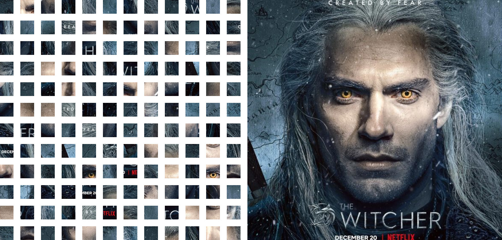

# image_assembler
**Image Assembler App** is responsible for collecting the patches and reassembling them into the original image.

BEFORE: mixed pieces ----------------------------------------------------------------> AFTER: final picture
